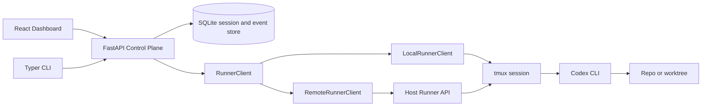
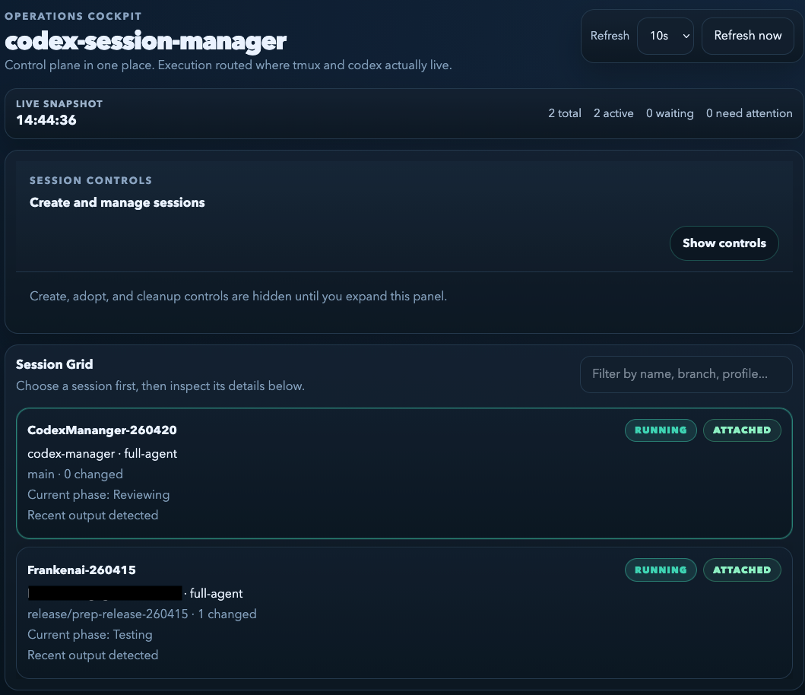
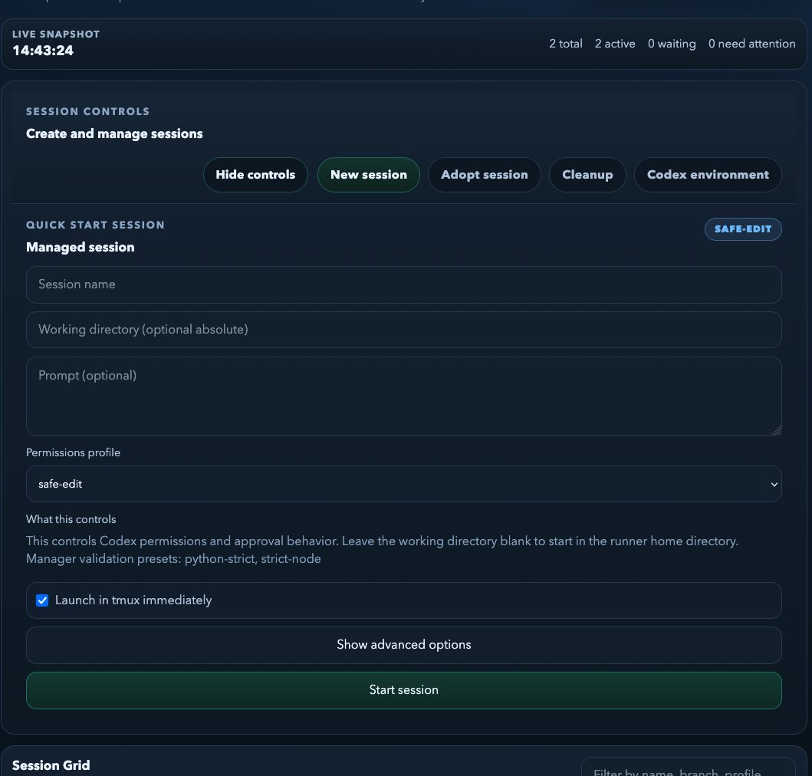
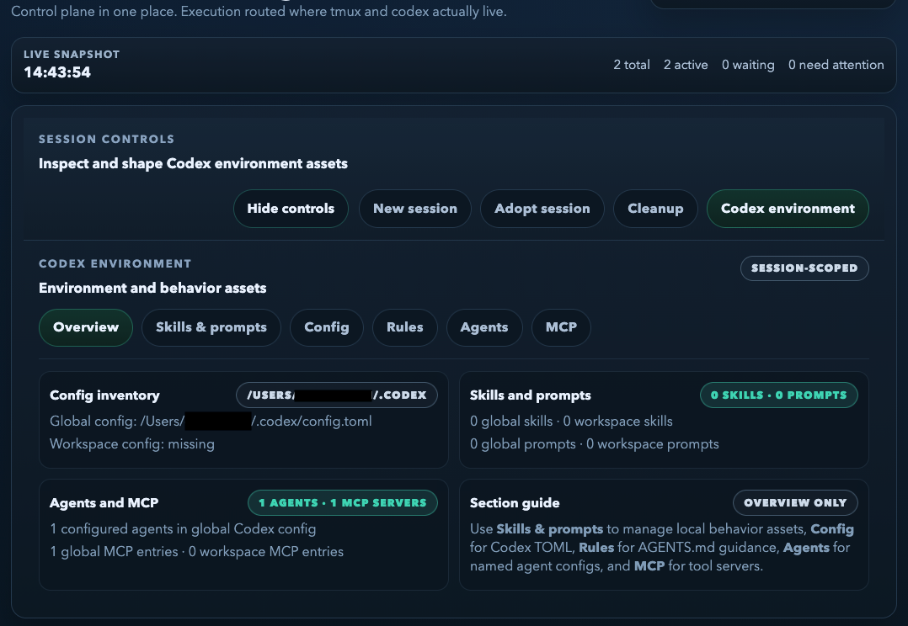
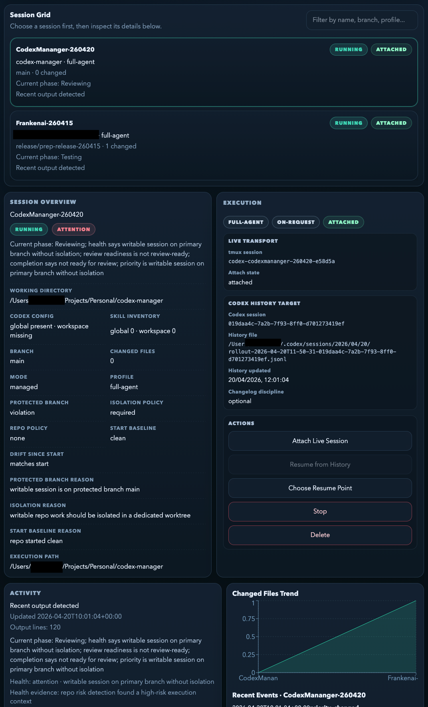

# CodexManager


Local-first control plane for Codex sessions on macOS.

CodexManager gives you a single operational surface for starting, observing, resuming, and governing Codex work across multiple repositories. It separates orchestration from execution so the dashboard can run locally or in Docker while `tmux`, `codex`, and git operations remain where they actually belong.

Today the product is macOS-first. Cross-platform support is a roadmap goal, but the current workflow and operational assumptions are built around macOS-hosted `tmux`, `codex`, and local repo access.

## Why CodexManager

Running Codex directly in terminals works until you need to answer operational questions:

- Which sessions are still active, idle, blocked, or lost?
- Which repo is each session touching, and from which branch or worktree?
- Can I safely resume this work later if the original terminal is gone?
- What validation has been observed, and where does human attention belong next?

CodexManager is built to answer those questions without turning terminal workflows into guesswork.

## What It Does

- Start managed Codex sessions with optional worktree isolation.
- Adopt existing Codex history and resume it as a first-class workflow.
- Track session lifecycle, activity, attachment state, repo path, branch, and changed files.
- Persist session and event history in SQLite under `~/.codexmgr` or `CODEXMGR_HOME`.
- Expose a dashboard for session control, logs, state changes, and environment management.
- Route execution through a host runner so Dockerized UI does not break host `tmux`, `codex`, or git behavior.
- Manage Codex-adjacent assets from one place: config, rules, prompts, skills, agents, MCP servers, and manager-owned rules.

## Product Model

```text
Manager -> runner -> tmux session -> Codex CLI process -> repo/worktree
```

The manager owns identity, persistence, and observability. The runner owns execution against the real host environment.

## Architecture



## Product Views

### Dashboard overview



### Session control workflow



### Codex environment management



### Codex session management



## Key Capabilities

### Session lifecycle

- Start, inspect, stop, delete, and bulk-clean managed sessions.
- Reattach to live tmux-backed sessions.
- Resume from persisted Codex history after the original tmux process is gone.
- Adopt historical Codex sessions into the manager.

### Observability

- Status model with `created`, `starting`, `running`, `waiting_input`, `idle`, `finished`, `failed`, `stopped`, and `lost`.
- Event timeline, output tail, activity tracking, and attachment presence.
- Repo metadata including branch, worktree path, changed-file counts, and overlap indicators.
- Health, priority, repo risk, review readiness, and completion-state signals.

### Governance and environment management

- Codex config editing and previewing.
- AGENTS.md and rules management.
- Manager-owned structured rules and match previewing.
- Skills, prompts, agents, and MCP management from the dashboard.
- Validation preset and recipe materialization support.

## Quick Start

### Recommended: durable Docker dashboard + host runner

Use the durable stack scripts. Do not start the dashboard with plain `docker compose up -d --build codexmgr`.

```bash
./bin/start_stack.sh
```

Open:

```text
http://127.0.0.1:8791/
```

Useful companion commands:

```bash
./bin/restart_stack.sh
./bin/stop_stack.sh
./bin/smoke_stack.sh
```

This deployment model keeps the dashboard/API in Docker while execution stays on the host, which is the reliable path when `tmux`, `codex`, and repo access need to stay native.

### What the durable stack gives you

- Docker dashboard on `127.0.0.1:8791`
- tmux-hosted runner session `codexmgr-host-runner`
- shared manager home at `${HOME}/.codexmgr`
- shared runner key at `${HOME}/.codexmgr/runner_api_key`
- runner log at `${HOME}/.codexmgr/logs/runner.log`

### Optional overrides

```bash
export CODEXMGR_HOST_HOME=/tmp/codexmgr-shared
export CODEXMGR_CONTAINER_HOME=/tmp/codexmgr-shared
export RUNNER_API_KEY=dev-runner-key
export CODEXMGR_HOST_PORT=8791
export RUNNER_PORT=8788
./bin/start_stack.sh
```

If you want to expose host repos to the container with explicit path mapping:

```bash
export CODEXMGR_HOST_REPO_ROOT=/path/to/host/projects
export CODEXMGR_CONTAINER_REPO_ROOT=/path/to/container/projects
docker compose -f docker-compose.yml -f docker-compose.repos.yml up -d --build
```

## Common Workflows

### Start a managed session

```bash
cd backend
python3 -m venv .venv
source .venv/bin/activate
pip install -e .

codexmgr start --name vat-fix --repo /path/to/repo --profile safe-edit --no-launch
codexmgr list
codexmgr inspect vat-fix
```

### Start with worktree isolation

```bash
codexmgr start --name vat-fix --repo /path/to/repo --profile safe-edit --create-worktree
```

### Start against a plain folder and initialize git

```bash
codexmgr start --name vat-fix --repo /path/to/folder --profile safe-edit --auto-init-git
```

### Require a starter `CHANGELOG.md` entry

```bash
codexmgr start --name vat-fix --repo /path/to/repo --profile safe-edit --require-changelog
```

### Serve the UI directly from the backend

```bash
codexmgr ui
```

If `frontend/dist` exists, `codexmgr ui` serves both the API and the built frontend.

## Local Development

### Backend

```bash
cd backend
python3 -m venv .venv
source .venv/bin/activate
pip install -e .
```

### Frontend

```bash
cd frontend
npm install
npm run build
```

For local frontend development with the API proxied to `http://127.0.0.1:8790`:

```bash
npm run dev
```

## Current State

CodexManager is already beyond a session launcher. The current product includes:

- live tmux reattach and Codex-history resume as separate workflows
- session archive and bulk cleanup operations
- lightweight dashboard health checks and faster session polling
- manager-rules inspection and effective-default previewing
- environment management for config, rules, skills, prompts, agents, and MCP

The current roadmap is maintained in [plans.md](plans.md).

## Design Principles

- Local-first: the manager should work with real host repos and real local tools.
- Deterministic observability: state transitions should be explicit, explainable, and persisted.
- Execution where it belongs: dashboards can move; `tmux`, `codex`, and git operations should not.
- Parallel-friendly: multiple active sessions should be governable without losing repo context.

## Operational Notes

- `tmux` is required for live launch, attach, and resume behavior.
- When `RUNNER_BASE_URL` is set, execution is delegated to the runner service instead of the API process.
- Without `tmux`, sessions can still be tracked, inspected, and managed as records.
- Set `CODEXMGR_HOME=/tmp/codexmgr-dev` to isolate local test data.

## Repository Layout

```text
backend/   FastAPI API, CLI, runner integration, persistence, tests
frontend/  React/Vite dashboard
bin/       Durable stack and smoke-test scripts
plans.md   Product and roadmap handoff
```

## Who This Is For

CodexManager is aimed at engineers who:

- run multiple Codex sessions in parallel
- want stronger operational visibility than a terminal alone provides
- need Docker UI convenience without sacrificing host-native execution
- care about resumability, auditability, and repo-aware control
- are comfortable with a macOS-first toolchain today while broader platform support is still ahead

## Roadmap Focus

Current next-step themes:

- structured manager-rules editing for common categories
- stronger dependency reporting for manager-owned rules
- improved resume and reopen ergonomics
- better archival and validation intelligence
- broader platform support beyond the current macOS-first deployment model

## License

No license file is published in this repository yet.
